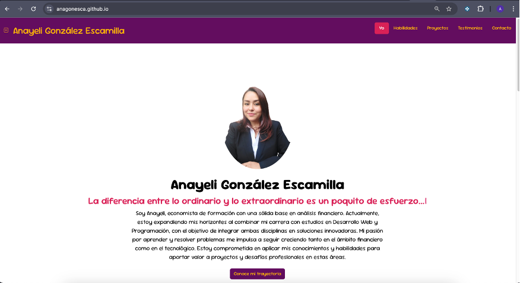
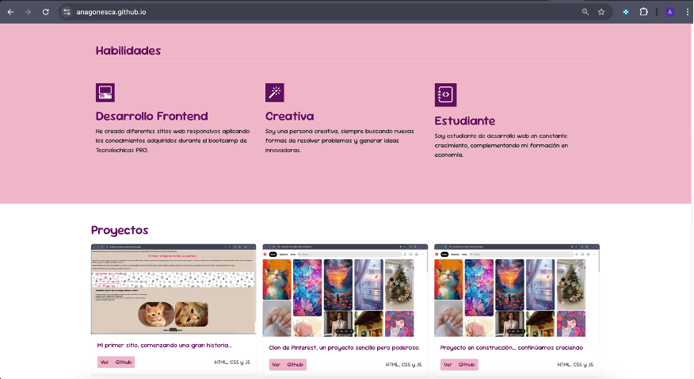

## Portafolio de proyectos 
Hola soy ***Anayeli González Escamilla***, desarrolladora web junior, me encuentro en un proceso de expansión de habilidades y conocimientos para poder hacer ***tus sueños realidad***...
_______
### El proyecto cuenta con las secciones de:

- 🛠️ *Habilidades.*
- 🗂️ *Proyectos.*
- 🙋🏻‍♀️ *Testimonios.*
- 📧 *Contacto.*
_____
### Creado con:
- HTML.
- CSS.
- JavaScript.

    
    
____
### Vista Previa

____
## *Me encantaría colaborar contigo para hacer tus sueños realidad... contáctame.* 

*Correo*
[anagonesca@gmail.com](mailto:anagonesca@gmail.com)

### Creado en el bootcamp de Tecnolochicas Pro 🩷
[Tecnolochicas](https://tecnolochicas.mx/)

